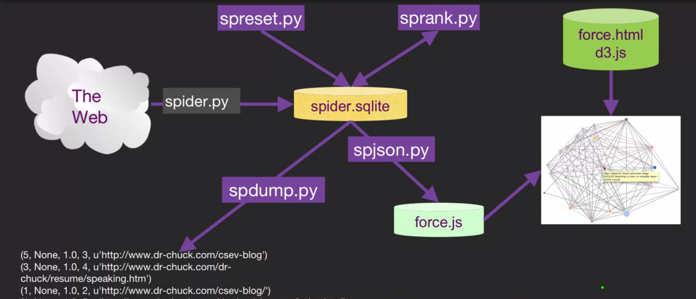

#Python Search Spider/Webcrawler, Page Ranker, and Visualizer
<h4>This is a set of programs that emulate some of the functions of a search engine. They store their data in a SQLITE3 
database named 'spider.sqlite'.  This file can be removed at any time to restart the process.</h4>   

<strong> Overview of this project:</strong>  

 You should install the SQLite browser to view and modify 
the databases from: http://sqlitebrowser.org/

<strong> spider.py crawls a web site and pulls a series of pages into the database, recording the links 
between pages. </strong>

 TO run this program:  
Mac:  
rm spider.sqlite 
python3 spider.py

Windows:  
del spider.sqlite  
spider.py

***

<strong>Sample run:</strong>

Enter web url or enter: http://www.dr-chuck.com/  
['http://www.dr-chuck.com']  
How many pages:2  
1 http://www.dr-chuck.com/ 12  
2 http://www.dr-chuck.com/csev-blog/ 57  
How many pages:

***

In this sample run, we told it to crawl a website and retrieve two 
pages.  If you restart the program again and tell it to crawl more
pages, it will not re-crawl any pages already in the database.  Upon 
restart it goes to a random non-crawled page and starts there.  So 
each successive run of spider.py is additive.

Mac: python3 spider.py  
Win: spider.py

***

<strong>Sample run:</strong>

Enter web url or enter: http://www.dr-chuck.com/  
['http://www.dr-chuck.com']  
How many pages:3  
3 http://www.dr-chuck.com/csev-blog 57  
4 http://www.dr-chuck.com/dr-chuck/resume/speaking.htm 1  
5 http://www.dr-chuck.com/dr-chuck/resume/index.htm 13  
How many pages:  

***

You can have multiple starting points in the same database - 
within the program these are called "webs".   The spider
chooses randomly amongst all non-visited links across all
the webs.

<strong>If you want to dump the contents of the spider.sqlite file, you can 
run spdump.py as follows:</strong>

Mac: python3 spdump.py  
Win: spdump.py

***

<strong>Sample run:</strong>

(5, None, 1.0, 3, u'http://www.dr-chuck.com/csev-blog')  
(3, None, 1.0, 4, u'http://www.dr-chuck.com/dr-chuck/resume/speaking.htm')  
(1, None, 1.0, 2, u'http://www.dr-chuck.com/csev-blog/')  
(1, None, 1.0, 5, u'http://www.dr-chuck.com/dr-chuck/resume/index.htm')  
4 rows.  

***

This shows the number of incoming links, the old page rank, the new page
rank, the id of the page, and the url of the page.  The spdump.py program
only shows pages that have at least one incoming link to them.

<strong>Once you have a few pages in the database, you can run Page Rank on the
pages using the sprank.py program.  You simply tell it how many Page
Rank iterations to run as follows: </strong>

Mac: python3 sprank.py  
Win: sprank.py 

***

<strong>Sample run:</strong>

How many iterations:2  
1 0.546848992536  
2 0.226714939664  
[(1, 0.559), (2, 0.659), (3, 0.985), (4, 2.135), (5, 0.659)]  

***

You can dump the database again to see that page rank has been updated:

Mac: python3 spdump.py  
Win: spdump.py 

***

<strong>Sample run:</strong>

(5, 1.0, 0.985, 3, u'http://www.dr-chuck.com/csev-blog')  
(3, 1.0, 2.135, 4, u'http://www.dr-chuck.com/dr-chuck/resume/speaking.htm')  
(1, 1.0, 0.659, 2, u'http://www.dr-chuck.com/csev-blog/')  
(1, 1.0, 0.659, 5, u'http://www.dr-chuck.com/dr-chuck/resume/index.htm')  
4 rows.  

***

You can run sprank.py as many times as you like and it will simply refine
the page rank the more times you run it.  You can even run sprank.py a few times
and then go spider a few more pages sith spider.py and then run sprank.py
to converge the page ranks.

<strong>If you want to restart the Page Rank calculations without re-spidering the 
web pages, you can use spreset.py as follows:</strong>

Mac: python3 spreset.py  
Win: spreset.py 

All pages are set to a rank of 1.0 and we run the ranking program again as follows:

Mac: python3 sprank.py  
Win: sprank.py 

***

<strong>Sample run:</strong>

How many iterations:50  
1 0.546848992536  
2 0.226714939664  
3 0.0659516187242   
4 0.0244199333  
5 0.0102096489546  
6 0.00610244329379  
...  
42 0.000109076928206  
43 9.91987599002e-05  
44 9.02151706798e-05  
45 8.20451504471e-05  
46 7.46150183837e-05  
47 6.7857770908e-05  
48 6.17124694224e-05  
49 5.61236959327e-05  
50 5.10410499467e-05  
[(512, 0.02963718031139026), (1, 12.790786721866658), (2, 28.939418898678284), (3, 6.808468390725946), (4, 13.469889092397006)]  

***

For each iteration of the page rank algorithm it prints the average
change per page of the page rank.   The network initially is quite 
unbalanced and so the individual page ranks are changing wildly.
But in a few short iterations, the page rank converges.  You 
should run prank.py long enough that the page ranks converge.

<strong>If you want to visualize the current top pages in terms of page rank,
run spjson.py to write the pages out in JSON format to be viewed in a
web browser.</strong>

Mac: python3 spjson.py  
Win: spjson.py  

***

<strong>Sample run:</strong>

Creating JSON output on spider.js...  
How many nodes? 30  
Open force.html in a browser to view the visualization  

***

You can view this data by opening the file force.html in your web browser.  
This shows an automatic layout of the nodes and links.  You can click and 
drag any node and you can also double click on a node to find the URL
that is represented by the node.

This visualization is provided using the force layout from: http://mbostock.github.com/d3/

If you rerun the other utilities and then re-run spjson.py - you merely
have to press refresh in the browser to get the new data from spider.js.
